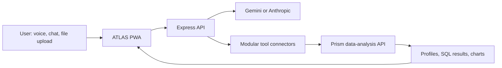

# ATLAS — Voice-First AI Assistant

> A personal AI assistant that combines voice interaction, a progressive web app interface, modular tool use, and live dataset analysis through [Prism](https://github.com/anonymousnotavailable/prism).

[Explore the Prism data-analysis demo →](https://prism-vdef.onrender.com) · [View the data-analysis engine →](https://github.com/anonymousnotavailable/prism)

## Why this project exists

Most AI chat interfaces stop at a text response. ATLAS was built to be a more useful working companion: it can hold a conversation, retain approved long-term facts, use connected tools, and help analyse a CSV or Excel workbook in context.

For data work, ATLAS passes the dataset task to Prism rather than inventing answers. That means it can profile a file, run real DuckDB SQL, produce charts, and move between sheets in a workbook while keeping the interaction conversational.

## Highlights

- **Voice-first interaction** — browser speech recognition, streamed replies, and browser speech synthesis with an optional ElevenLabs upgrade
- **Tool-use assistant loop** — provider abstraction for Gemini or Anthropic, with modular connectors that register a schema plus an execution function
- **Data analysis inside the conversation** — upload CSV/XLSX, inspect dataset quality, run SQL, generate a chart, and switch sheets without leaving the assistant
- **Human-context memory** — editable knowledge-base files plus long-term facts that can be saved, recalled, and forgotten
- **Progressive web app** — installable with offline shell caching, responsive UI, and persistent local chat history
- **Connected services** — optional Gmail, Google Calendar, device location, web lookup, generated artifacts, and push briefing capabilities
- **Privacy-aware architecture** — secrets live in environment variables on the backend; the browser never receives LLM-provider keys

## Architecture



## Data-analysis flow

1. Upload a CSV or Excel workbook through ATLAS.
2. The Express backend forwards the file to Prism and records the active dataset.
3. ATLAS uses dedicated tools for a summary, data-quality profile, DuckDB SQL query, chart, or sheet switch.
4. Results return to the chat UI as actual tables or images—not model-generated guesses.

> **Interview note:** ATLAS is an AI product / applied analytics integration, not a claim that I trained a foundation model. Its strongest data-science evidence is its Prism integration and the use of real, deterministic analysis operations.

## Tech stack

| Area | Technologies |
| --- | --- |
| Frontend | HTML, CSS, JavaScript, Web Speech API, Service Workers, Web App Manifest |
| Backend | Node.js, Express, NDJSON streaming |
| AI integration | Gemini or Anthropic provider adapters; structured tool calls |
| Data analysis | Prism API, pandas, DuckDB SQL, matplotlib charts |
| Optional integrations | Gmail, Google Calendar, Tavily search, ElevenLabs TTS, Web Push |
| Deployment | Render configuration included |

## Run locally

### Prerequisites

- Node.js 18+
- At least one chat-provider key: `GEMINI_API_KEY` or `ANTHROPIC_API_KEY`

### Start

```bash
git clone https://github.com/anonymousnotavailable/Atlas.git
cd Atlas/server
cp .env.example .env
# Add your provider key to .env
npm install
npm start
```

Open [http://localhost:8787](http://localhost:8787).

On Windows, `server/start.bat` can create the initial `.env`, install dependencies, and start the server.

### Enable Prism-powered data analysis (optional)

1. Run or deploy [Prism](https://github.com/anonymousnotavailable/prism).
2. Set `PRISM_API_URL` in `server/.env`.
3. Upload a CSV or Excel file through the 📊 control in ATLAS.

See [server/README.md](server/README.md) for backend endpoints and [CONNECTORS.md](CONNECTORS.md) for each optional integration.

## Project structure

```text
.
├── index.html              # PWA chat interface
├── manifest.json / sw.js   # Installability and offline shell
├── knowledge/              # Editable assistant context
├── server/
│   ├── server.js           # Express routes and streaming agent loop
│   ├── providers/          # Gemini / Anthropic adapters
│   ├── connectors/         # Tool definitions and implementations
│   └── lib/                # Push, briefing, scheduling, usage helpers
├── CONNECTORS.md           # Integration setup guide
└── render.yaml             # Render deployment configuration
```

## Current scope

ATLAS is intentionally a personal assistant, not a generic SaaS chatbot. Some service connectors require a user to supply and authorize their own credentials; unconfigured connectors report what is missing rather than silently failing. See [PLAN.md](PLAN.md) for documented work in progress and validation notes.

## Related project

**[Prism](https://github.com/anonymousnotavailable/prism)** is the flagship data-science project in this portfolio: an Auto-EDA and analytics workbench with deterministic cleaning workflows, SQL, statistics, forecasting, baseline ML, and a live deployment.
